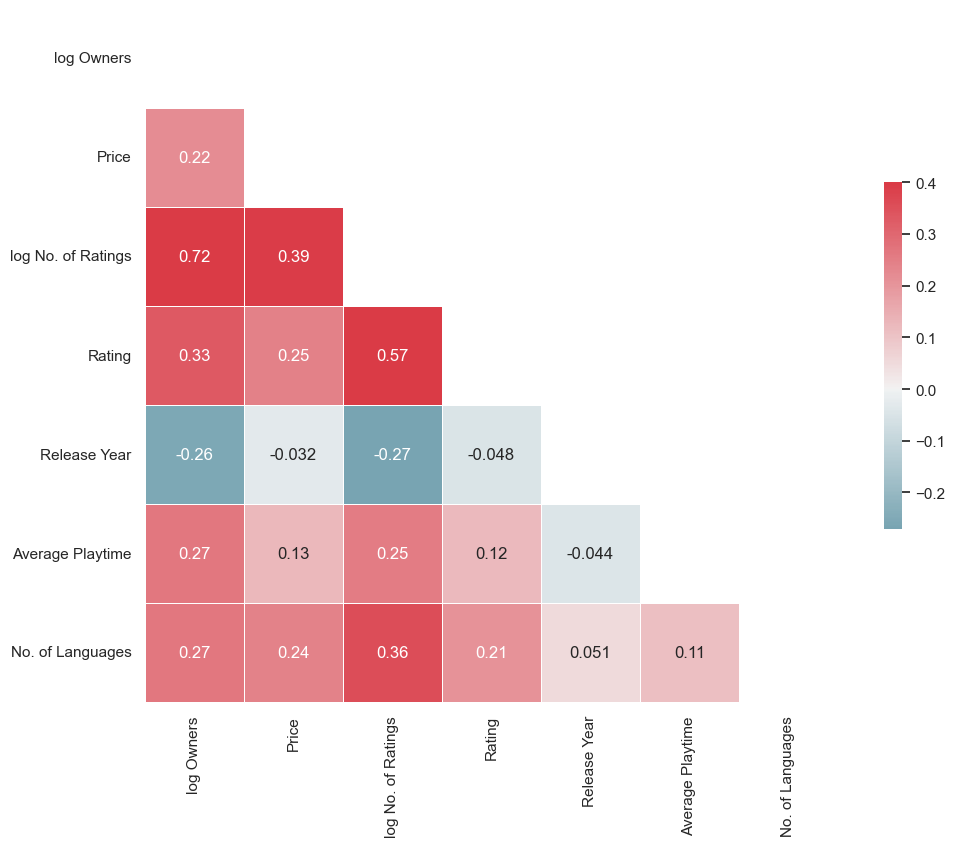

# LHL-Capstone_Project

## Project/Goals
The goal of this project is to investigate the relationship between video game sales on the Steam Store and various factors, including review count. Additionally, we aim to identify key elements that game developers can leverage to increase their chances of creating popular games. This project takes inspiration from the work of [Nik Davis](https://nik-davis.github.io/tag/steam.html), whose research has provided valuable insights into the gaming industry. By analyzing review counts and exploring potential correlations with sales, we hope to uncover patterns and potentially develop a formula that game developers can utilize to optimize their game's success.

## Process
### Gathered data from SteamSpy and Steam Store
- Utilized SteamSpy API and Python’s ThreadPoolExecutor to run parallel get requests. 
- Due to time constraints and Steam Store API request limit, Steam Store portion of data was downloaded from [Kaggle](https://www.kaggle.com/datasets/vicentearce/steam-and-steam-spy-raw-datasets?select=steamspy_data.csv).

### Data cleaning
- Dropped columns with multiple null values:
⋅⋅* SteamSpy: `score_rank`, `userscore`
⋅⋅* Steam Store:`controller_support`, `dlc`, `fullgame`, `legal_notice`, `drm_notice`, `ext_user_account_notice`, `demos`, `metacritic`, `reviews`, `recommendations`, `achievements`
- Dropped columns that were time-specific:
⋅⋅* SteamSpy: `average_2weeks`, `median_2weeks` (average and median playtime in the last 2 weeks), `ccu`(peak concurrent users yesterday), `price` and `discount`
- Dropped column `type` in the Steam Store dataset since there is only one value `game`
- Transformed data types in some columns:
⋅⋅* SteamSpy: `owners`, `language` and `initialprice`
⋅⋅* Steam Store:`required_age`, `is_free`
- Dropped columns that we already have in the SteamSpy dataset: `supported_languages`, `developers`, `publishers`, `genres`
- Removed rows with null values

### Merging data
- used inner join to merge SteamSpy and Steam Store data to get richer/additional data for analysis
- key column for the inner join was `appid` (the game's ID) since it's unique

### Explored data
- Checked columns for data types and any unexpected values

### Analyzed data
- Different queires were used to analyze data.
- The project utilized Ordinary Least Squares (OLS) regression models to predict the number of game owners.

## Results

- The number of game releases with 20,000 or more owners has remained relatively consistent since 2014, averaging between 1,000 and 2,000 releases per year, as depicted by the gray bars in .
- Among the top 10 games, 9 were Singleplayer games, with a majority falling under the Action or Indie genres, as illustrated in .
- The Multiple Linear Regression Analysis utilizing 55 variables achieved an Adjusted R-squared of 0.675, indicating that these variables can explain approximately 68% of the variability in predicting the number of game owners. After removing 22 variables with large p-values, the model's Adjusted R-squared reduced to 0.638. Notably, the Total Number of Ratings alone explained 58% of the variability, with a Coefficient of 25.8255 and a Constant of 34,840. This implies that a game with 1,000 reviews is estimated to have around 61,000 owners.
- Analysis of the dataset revealed that genres such as Massively Multiplayer, Racing, RPG, Simulation, Sports, and Strategy have significant growth potential. On the other hand, the Casual and Indie game markets appear oversaturated, posing challenges for new games to stand out among numerous options, as shown in .
- Several noticeable trends emerged, including positive correlations between the number of owners and the number of ratings, between price and the number of ratings, and between the number of languages and the number of ratings, as depicted in .

## Challenges
- Acquiring data from SteamSpy and Steam Store posed significant difficulties due to request limitations. To overcome this, data from the Steam Store was obtained from Kaggle, as it provided a more accessible source with a limit of 250 requests per 5 minutes. With approximately 84,000 game titles requiring data collection, this approach proved necessary.
- While the regression model demonstrates that reviews serve as reliable predictors of game sales, it is crucial to acknowledge the limitations of the data. The number of owners of the game data comes with a notable margin of error, which must be taken into account when interpreting the results.
- An additional challenge stems from the absence of popular sports titles from Electronic Arts (EA) on the Steam Store. This could explain the lack of sports games available on the platform, highlighting a potential influence on the analysis and findings.

## Future Goals
- Enhance prediction accuracy by integrating additional datasets into the analysis.
- Gather historical data on game prices and player numbers to conduct trend analysis and enable forecasting capabilities.
- Incorporate user behavior and preferences as factors to identify game types that generate higher revenue.
- Explore data from streaming platforms and esports to develop predictive models for assessing game success and popularity.